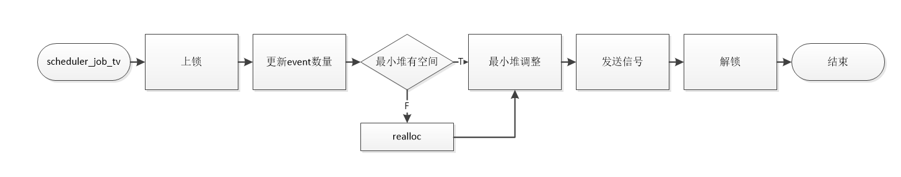
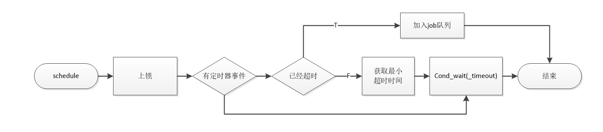

#  定时器的调度设计

## 一. 目的

创建一个定时器调度器，他需要满足以下需求：

* 创建一个定时器调度器
* 销毁该调度器
* 将一个job添加到调度器
* 清空所有调度器中的任务

## 二. 总体设计

​	在threads_0的基础上，添加一个定时器调度的任务。

​	向定时器调度器添加任务的时候除了用来描述任务的job_t外，还需要一个超时时间，定时器调度器会把注册进来的任务以最小堆的形式保存，如果超时时间到，则执行这个任务。

## 三. 详细设计

### 3.1 结构体设计

​	依然从小到大来设计结构体

#### 1. event

​	一个event必然包含一个job_t类型字段，还需要一个超时时间。

~~~c
typedef struct event_t event_t;

struct event_t
{
    job_t *job;
    struct timeval time;
};
~~~

#### 2. scheduler

​	需要堆管理相关的数据结构来保存定时事件，为了保护数据的并发访问，需要一个锁，为了同步事件的到来，需要一个信号量。

~~~c
struct scheduler_t
{
    /* public interface */

    /* private member */
    event_t **heap;
    int heap_size;
    int event_count;
    pthread_mutex_t mutex;
    pthread_cond_t cond;
};
~~~

### 3.2 接口设计

​	定时器调度器需要有创建和销毁的接口，需要有将event加入调度的接口，需要清除堆中注册所有事件的接口。

~~~c
struct scheduler_t
{
    /* public interface */
    void (*schedule_job_tv)(scheduler_t *this, job_t *job, struct timeval tv);
    void (*flush)(scheduler_t *this);
    void (*destory)(scheduler_t *this);

    /* private member */
};
~~~

​	加入定时器的任务一定有一个超时时间，所以在接口设计为这样的：

~~~c
static void __scheduler_job_tv(scheduler_t *this, job_t *job, struct timeval tv);
~~~

​	清空堆中的event接口，这就是一个最小堆出队的过程。

~~~c
static void __scheduler_flush(scheduler_t *this);
~~~

### 3.3 调度event

​	调度event本身也是一个job，而且是一个不需要公平入队的任务，可以在调度完成后继续执行。所以他的属性是JOB_REQUEUE_TYPE_DIRECT

​	我们将会创建一个任务，专门用来处理最小堆中的定时器事件，核心思路就是检查最小堆中的第一个元素，如果他到期了，那就调用processor提供的queue_job()方法，将这个任务排入任务队列，等待其他线程资源来处理。如果还未到期，那么就看看我们还需要等多久，通过pthread_cond_timedwait()来等待，期间如果有定时器事件加入堆中，那就重新来选择下一个到期事件，否则的话就等到一个超时时间后下次执行这个调度函数的时候刚好是最近的一个任务到期的时刻。此时再将任务加入任务队列。如果没有定时器事件，那么就一直阻塞在一个信号量上。

​	
